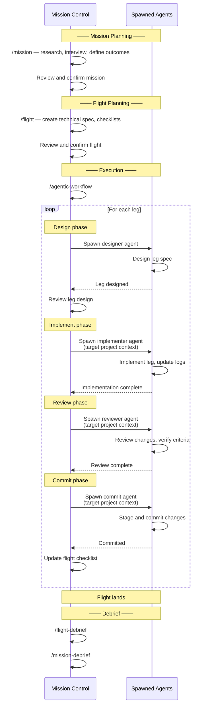

# Flight Control

An AI-first software development lifecycle methodology using aviation metaphors to bridge human intent and AI execution.

## What is Mission Control?

This repository is a **centralized command center** for managing multiple projects in parallel. Each project may have its own stack, systems, and constraints, but mission-control provides a consistent workflow and orchestration layer across all of them.

- **Project registry** — Track active projects with paths, remotes, and configurations
- **Shared methodology** — Apply structured planning regardless of project differences
- **Claude Code skills** — Interactive tools for mission, flight, and leg creation

Artifacts (missions, flights, legs) are created in target projects, not here. Mission-control holds the methodology, skills, and coordination—your projects hold the work.

## The Aviation Model

Flight Control organizes work into three hierarchical levels, each optimized for its primary audience:

```
Mission (human-optimized)
  └── Flight (balanced)
        └── Leg (AI-optimized)
```

- **Missions** define outcomes in human terms—what success looks like and why it matters
- **Flights** translate outcomes into technical specifications with planning checklists
- **Legs** provide structured, specific instructions optimized for AI consumption

## Why Aviation?

Aviation succeeds through layered planning and clear handoffs. Pilots follow flight plans but improvise when conditions demand it—weather, emergencies, ATC instructions. Structured planning enables effective improvisation by providing a baseline to deviate from and return to. Similarly, Flight Control separates strategic intent (missions) from tactical execution (legs), with flights serving as the translation layer.

## Agentic Workflow

**LLM orchestrators**: Run `/agentic-workflow` to drive multi-agent flight execution with Claude Code. The skill orchestrates the full leg cycle — design, implement, review, commit — using three separate Claude instances.

## Getting Started

### Prerequisites

- [Claude Code](https://docs.anthropic.com/en/docs/claude-code) installed
- A project on disk with a git remote, initialized with Claude Code (`claude /init`)

### Walkthrough

1. **Clone mission-control** — Clone this repo and open it in Claude Code.

2. **Set up the projects registry** — Run `/init-mission-control` (or manually copy `projects.md.template` → `projects.md` and fill in your project details). This creates the central registry that all skills read from.

3. **Initialize your project** — Run `/init-project` and select your project. This creates `.flightops/` in your target project with artifact configuration, methodology reference, and crew definitions.

4. **Review agent crew files** — Check the files in `{project}/.flightops/agent-crews/`. These define the crew composition (roles, models, prompts) for each phase. Customize them to your needs.

5. **Create a mission** — Run `/mission`. This interviews you about desired outcomes and creates a mission artifact in your target project.

6. **Design a flight** — Run `/flight` to break the mission into a technical specification with pre/in/post-flight checklists.

7. **Execute** — Run `/agentic-workflow` to drive multi-agent implementation. This orchestrates design, implement, review, and commit cycles across legs.

8. **Debrief** — Run `/flight-debrief` and `/mission-debrief` after completion to capture lessons learned.

## Documentation

1. **[Overview](docs/overview.md)** — Philosophy and principles behind Flight Control
2. **[Missions](docs/missions.md)** — Writing outcome-driven mission statements
3. **[Flights](docs/flights.md)** — Creating technical specifications with pre/post checklists
4. **[Flight Logs](docs/flight-logs.md)** — Recording execution progress and decisions
5. **[Legs](docs/legs.md)** — Structuring AI-optimized implementation steps
6. **[Workflow](docs/workflow.md)** — End-to-end flow from mission to completion

## Core Concepts

### The Audience Gradient

Documentation becomes progressively more structured as it moves down the hierarchy:

| Level | Audience | Style |
|-------|----------|-------|
| Mission | Humans, stakeholders | Narrative prose, outcome-focused |
| Flight | Developers, AI | Technical spec with checklists |
| Leg | AI agents | Structured format, explicit criteria |

### Lifecycle States

Each level tracks progress through defined states:

- **Missions**: `planning` → `active` → `completed` (or `aborted`)
- **Flights**: `planning` → `ready` → `in-flight` → `landed` → `completed` (or `aborted`)
- **Legs**: `planning` → `ready` → `in-flight` → `landed` → `completed` (or `aborted`)

### Scaling

Flight Control scales from solo developers to teams. The methodology provides structure and continuity across sessions regardless of team size.

## Artifact Organization

The hierarchy nests naturally:

```
Mission
├── Mission Debrief
└── Flight
    ├── Flight Log
    ├── Flight Briefing
    ├── Flight Debrief
    └── Leg
```

How you store these artifacts depends on your project's needs. Flight Control supports multiple artifact systems:

- **Markdown files** — Version-controlled documentation in your repository
- **Issue trackers** — Jira, Linear, GitHub Issues with linked relationships
- **Hybrid** — Missions in markdown, flights/legs as tickets

Each project configures its artifact system during initialization. The methodology and Claude Code skills adapt to your choice.

## Claude Code Skills

Flight Control includes Claude Code skills for interactive planning:

| Skill | Purpose |
|-------|---------|
| `/init-mission-control` | Set up the projects registry |
| `/init-project` | Initialize a project for Flight Control |
| `/mission` | Create outcome-driven missions through research and interview |
| `/flight` | Create technical flight specs from missions |
| `/leg` | Generate implementation guidance for LLM execution |
| `/flight-debrief` | Post-flight analysis for continuous improvement |
| `/agentic-workflow` | Drive multi-agent flight execution |
| `/mission-debrief` | Post-mission retrospective for outcomes assessment |
| `/daily-briefing` | Cross-project status report with health assessment |

## Recommended Workflow

All work runs from a single **Mission Control** session. Mission Control handles planning directly and spawns agents into the target project's context for implementation, review, and commits. Each spawned agent gets a clean context with only the information it needs, while Mission Control maintains continuity across the entire flight.

### Context Strategy

- **Mission Control**: Long-running session spanning an entire flight — accumulates knowledge across legs, orchestrates all work
- **Spawned agents**: Fresh context per task — designed with precise instructions and the relevant artifacts, execute in the target project directory

Claude Code's version control in mission-control acts as the orchestrator for development of the remote project. No second interactive session is needed.

### The Cycle



### Why This Matters

A single orchestrating session eliminates context drift between planning and execution. Mission Control sees every leg's outcome and carries that knowledge forward into the next design. Spawned agents get clean, focused contexts — they don't need flight-wide memory because Mission Control provides exactly the context they need. Artifacts stay synchronized because one session owns the full lifecycle.

## License

[MIT](LICENSE)
